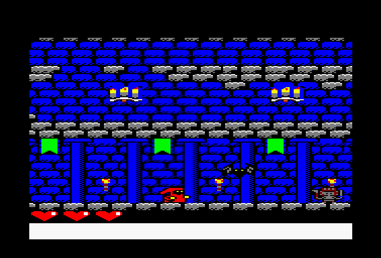
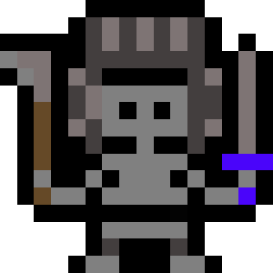
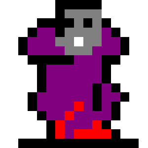
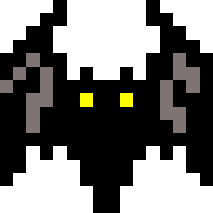
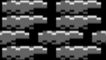
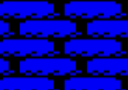
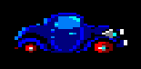

# OVERHEAP

Videojuego para el Amstrad CPC 464 presentado al concurso [CPCRetroDev](http://cpcretrodev.byterealms.com/)

### About

* [Project Twitter account @BastaCPC](https://twitter.com/BastaCpc)
+ [Making Of](readmeResources/makingof.pdf)
+ [Gameplay](https://www.youtube.com/watch?v=5zEelK0AENo)
+ [CPCRetroDev 2018 Awards Giving Ceremony](https://www.youtube.com/watch?v=N0Hwho0iWM0)
+ [ScreenShoots](readmeResources/ScreenShots)
### Controles

+ W: saltar
+ A: desplazarse a la izquierda
+ D: desplazarse a la derecha
+ P: disparar
+ X: siguiente ronda

### Objetivo

Tu objetivo es superar las 5 rondas que conforman el castillo. Para superar una ronda debes acabar con todos los enemigos. Al superar una ronda, el juego queda en pausa lo que te permite descansar antes de seguir. En el caso de morir, volverás al principio y los enemigos se “resetean”  volverán a tener 3 vidas y volverán a ser 2 enemigos en el primer nivel.

### Enemigos y mapa

|                                                   |                                                                                                                                                               |
|---------------------------------------------------|-------------------------------------------------------------------------------------------------------------------------------------------------------------------------------------------|
| | **ESQUELETO**. Cuando te detecta te dispara una ráfaga MORTAL.                                                                                                                            |
|     | **VAMPIRO**. Cuando te detecta dispara una ráfaga. Ten cuidado cuando te choques con él, es muy fuerte. Cuando tiene poca vida  se transforma.                                            |
|       |                                                                                                                                MURCIÉLAGO. La transformación del vampiro. Intentará huir!!| 
|           | **BLOQUE SÓLIDO**. Son bloques sólidos por los que puedes andar pero no atravesarlos, modificar o romper. Componen la estructura del mapa. Además se usan como plataformas donde saltar.                                                                                                                                                                                    | 
|         |                                                                                                                                                                                        **FONDO**. Como su nombre indica, este bloque representa al fondo del mapa. No tiene otra funcionalidad
 | Uno de nuestro enemigos se trata del coche que se usa en el clásico Chicago’s 30. ¡Intenta conducir el coche y ya veras que sorpresa!

### Créditos

+ Juan López Quiles jlq2@alu.ua.es https://github.com/psjuan97
+ José Luis Gómez Antón	Jlga10@alu.ua.es https://github.com/jlga10
+ Alejandro Aliaga Hyder ajah1@alu.ua.es https://github.com/nyaboronn

*Gracias a Fran Gallego por lo aprendido en las clases dadas durante el desarrollo y a todos los organizadores del evento por esta gran oportunidad.*

